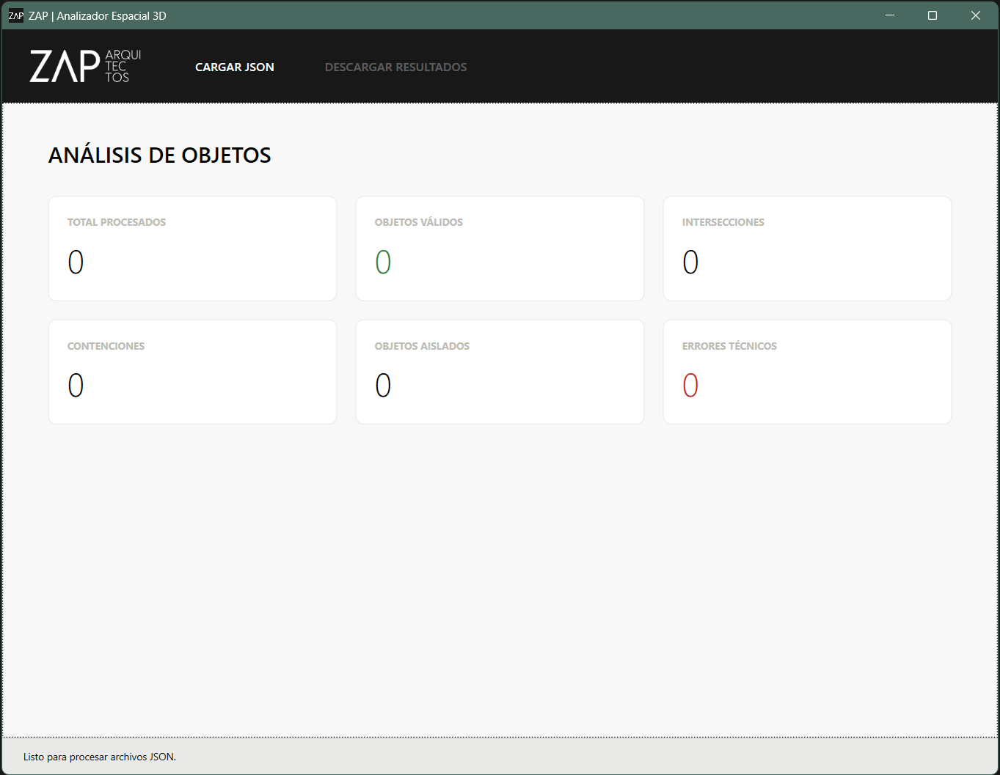
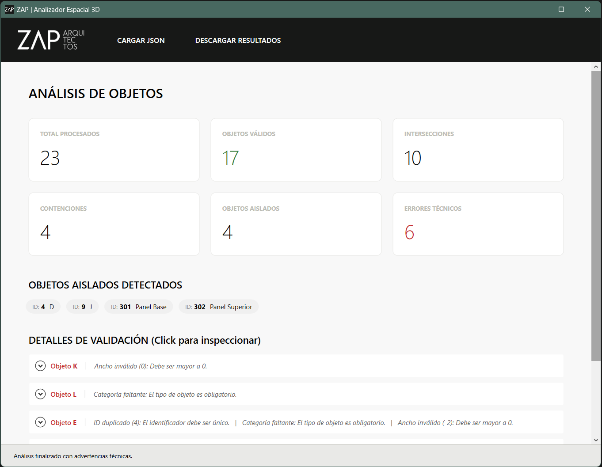
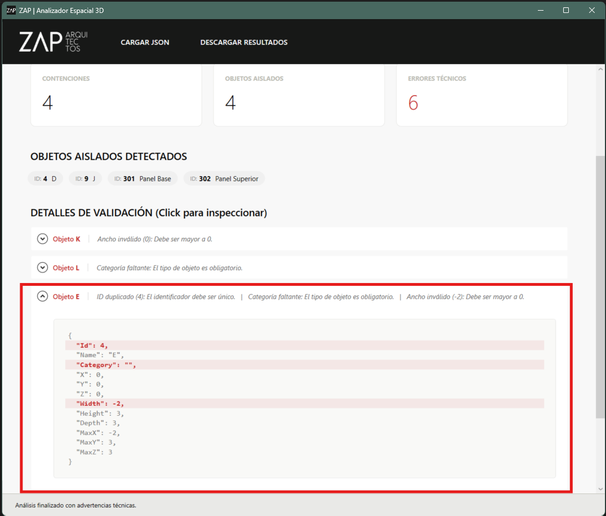
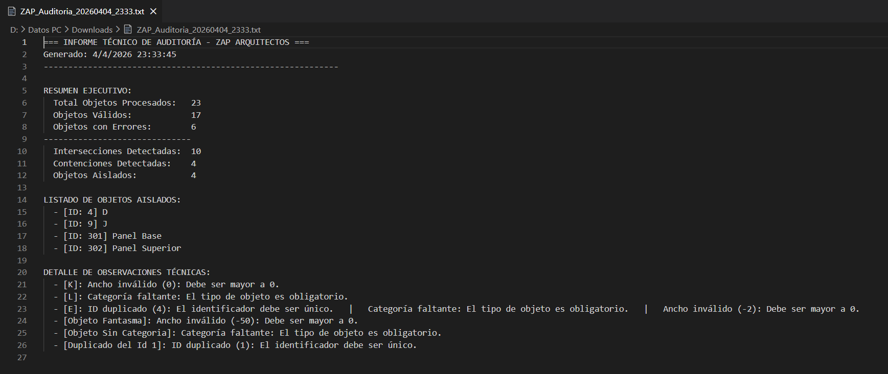

 

  

 

<h1 align="center">Prueba Técnica - Auditoría Espacial 3D</h1>

 

Solución técnica desarrollada para **ZAP ARQUITECTOS**, diseñada para la validación de esquemas y el análisis de relaciones espaciales (Intersección, Contención y Aislamiento) en colecciones de prismas rectangulares (AABB).

---
 

## 🛠️ Especificaciones Técnicas
- **Framework:** .NET 10.0 (WPF)
- **Arquitectura:** MVVM (Model-View-ViewModel)
- **Lenguaje:** C# 12
- **Principios:** SOLID, Clean Code, SRP.

---

## 📄 Documentación Obligatoria
Para cumplir con los requerimientos de la prueba técnica (Puntos 10.2 y 10.3), se adjuntan los siguientes informes detallados:

*   [**Informe de Proceso de Resolución**](docs/PROCESO_RESOLUCION.md): Decisiones de diseño, arquitectura y lógica espacial.
*   [**Informe de Uso de IA**](docs/USO_IA.md): Herramientas utilizadas, prompts representativos y validación crítica de código.

---

## 🚀 Cómo ejecutar la herramienta

### Opción A: Ejecución desde el Binario (Recomendado)
Para una revisión rápida sin necesidad de entorno de desarrollo:
1. Diríjase a la carpeta `/Ejecutable`.
2. Ejecute el archivo `ZapAnalyzer.Desktop.exe`. 
   *(Nota: Versión auto-contenida, no requiere instalación de .NET).*

### Opción B: Ejecución desde el Código Fuente
1. Requiere **Visual Studio 2022** (o posterior) con el SDK de **.NET 10** instalado.
2. Abra la solución `ZapAnalyzer.Desktop.sln`.
3. Presione `F5` para compilar e iniciar.

---

## 📂 Datos de Prueba Incluidos
En la raíz del proyecto se adjuntan dos archivos para testing:
1. `datos_prueba.json`: Contiene el set de datos base solicitado en la consigna, incluyendo **2 casos adicionales propios** (Intersección parcial y Contención profunda).
2. `datos_prueba_extensa.json`: Un set de datos extendido con múltiples escenarios complejos (habitaciones anidadas, muebles, pilares y errores de validación múltiples).

---

## 📸 Guía Visual de Uso

### 1. Interfaz Principal
Al iniciar, la aplicación presenta una interfaz minimalista alineada a la identidad corporativa de ZAP (inspirado en su web oficial).

### 2. Procesamiento de Datos
Al cargar un JSON, los indicadores (Cards) muestran métricas precisas. Se detectan objetos aislados listados por ID y Nombre.

### 3. Inspección Técnica de Errores
Haciendo clic sobre cualquier objeto en "Detalles de Validación", se despliega el código fuente resaltando las líneas exactas que fallan.

### 4. Reporte de Auditoría
El botón "Descargar Resultados" genera un archivo técnico `.txt` formateado para su lectura profesional.

---

## ⚖️ Licencia y Uso
Prueba técnica para el proceso de selección de **ZAP ARQUITECTOS**. 
Desarrollado con enfoque en calidad de software y UX intuitivo.
